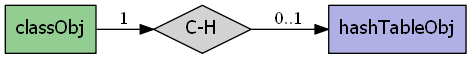
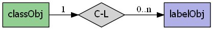
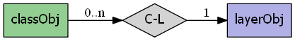
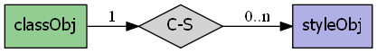

.. rubric:: Overview

The classObj has the following relationships:

.. rubric:: Examples

Class creation:

.. literalinclude:: /mapscript/mapscript-api/mapscript/tests/class_test.py
    :language: python
    :dedent: 8
    :start-after: def testConstructorWithArg(self):
    :end-before: def 

